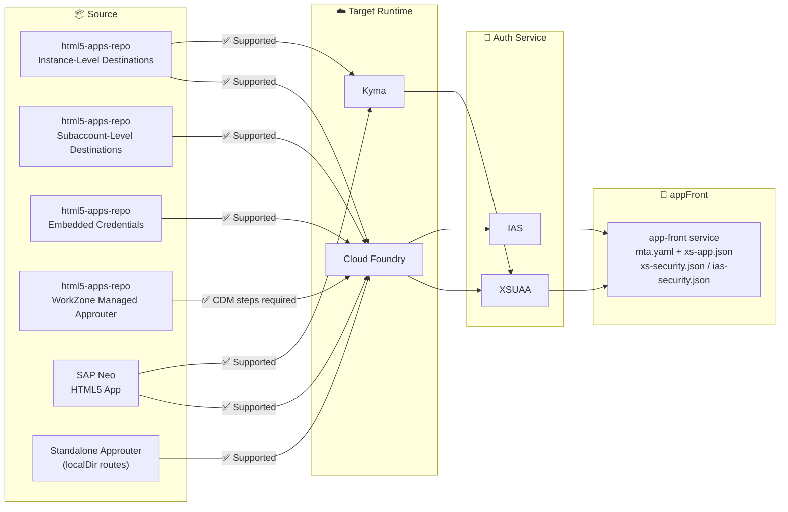

# AI Skills for HTML5 Applications Migration to Application Frontend Service

[](https://api.reuse.software/info/github.com/SAP-samples/html5-applications-migration-skills-for-sap-btp)

Claude Code plugin providing AI-assisted skills for **SAP BTP Application Frontend (appFront)** service: migrate existing HTML5 apps from Neo or html5-apps-repo, and validate appFront configurations.

---

## Table of Contents

- [Skills Overview](#skills-overview)
- [What is appFront?](#what-is-appfront)
- [Options Matrix](#options-matrix)
  - [Migration Paths](#migration-paths-appfrontmigrate)
  - [Supported Migration Paths](#supported-migration-paths)
- [Requirements](#requirements)
- [Download and Installation](#download-and-installation)
- [Usage](#usage)
  - [Migrating an app](#migrating-an-app)
  - [Validating an app](#validating-an-app)
- [Reference Material](#reference-material)
- [Architecture](#architecture)
- [Skill Behavior Summary](#skill-behavior-summary)
- [Known Issues](#known-issues)
- [How to obtain support](#how-to-obtain-support)
- [Contributing](#contributing)
- [Changelog](#changelog)
- [Related Resources](#related-resources)
- [License](#license)

---

## Skills Overview

| Skill | How to invoke | Description |
|-------|---------------|-------------|
| `migrate` | `/appfront:migrate [neo\|html5-repo\|standalone-approuter] [cf\|kyma] [xsuaa\|ias]` | Migrates an existing HTML5 app from SAP Neo, html5-apps-repo, or a standalone approuter (localDir) to appFront. Produces updated `mta.yaml`, `xs-app.json`, and `xs-security.json`. |
| `validate` | `/appfront:validate [path]` | Checks appFront configuration for correctness and deployment readiness. Produces a PASS/WARN/FAIL report for local files; optionally validates the live deployed app via browser. |
| `cleanup` | `/appfront:cleanup` | Undeploys a deployed appFront app from Cloud Foundry (optionally deleting service instances and keys) and removes the local output folder. Works for migrated apps (`appfront-migrated/`). |

---

## What is appFront?

**SAP Application Frontend (appFront)** is an SAP BTP service that provides a simpler deployment model for HTML5 applications compared to the older `html5-apps-repo` (HTML5 Application Repository) service. It eliminates the need for:
- A `destination-content` MTA module
- The `HTML5Runtime_enabled: true` flag on the destination service

This plugin helps teams migrate to appFront and stay productive during development.

---

## Options Matrix

### Migration Paths (`/appfront:migrate`)



### Supported Migration Paths

| Source | Target Runtime | Auth Service | Status |
|---|---|---|---|
| SAP Neo HTML5 App | Cloud Foundry | XSUAA | ✅ Fully documented |
| SAP Neo HTML5 App | Cloud Foundry | IAS | ✅ Fully documented |
| html5-apps-repo (managed approuter) | Cloud Foundry | XSUAA | ⚠️ Skill logic present — populate `references/migration-guides/html5-repo-to-appfront.md` for best results |
| html5-apps-repo (managed approuter) | Cloud Foundry | IAS | ⚠️ Skill logic present — populate `references/migration-guides/html5-repo-to-appfront.md` for best results |
| html5-apps-repo (managed approuter) | Kyma | XSUAA | ⚠️ Skill logic present — populate `references/migration-guides/html5-repo-to-appfront.md` for best results |
| html5-apps-repo (WorkZone managed approuter) | Cloud Foundry | XSUAA | ⚠️ Skill logic present — CDM steps required; populate `references/troubleshooting/workzone-integration.md` |
| Standalone approuter (localDir routes) | Cloud Foundry | XSUAA | ⚠️ Skill logic present — populate `references/migration-guides/standalone-approuter-to-appfront.md` for best results |

---

## Requirements

- **Claude Code CLI** — [Install Claude Code](https://docs.anthropic.com/en/docs/claude-code)
- **SAP BTP subaccount** with Application Frontend service entitlement
- **MBT (SAP MultiApps Build Tool)** — `npm install -g mbt` — for building MTAs after migration
- **CF CLI** — for Cloud Foundry deployments
- **Optional**: `afctl` ([appFront CLI](https://help.sap.com/docs/application-frontend-service/application-frontend-service/application-frontend-service-cli)) — for deploying, listing, and managing appFront applications; required for fetching the runtime URL after deployment

---

## Download and Installation

### Step 1 — Add the GitHub repository as a marketplace

```bash
claude plugin marketplace add https://github.com/SAP-samples/html5-applications-migration-skills-for-sap-btp.git
```

This clones the repository and registers it as a plugin source named `html5-applications-migration-skills-for-sap-btp`.

> **Note:** The URL must end in `.git`. Using the bare repository page URL (without `.git`) causes the error `Invalid marketplace schema: expected object, received string` because Claude Code receives an HTML page instead of the git transport.

### Step 2 — Install the plugin

```bash
claude plugin install appfront@html5-applications-migration-skills-for-sap-btp
```

### Verifying installation

After installation, restart Claude Code, then type `/` and look for `appfront:migrate`, `appfront:validate`, and `appfront:cleanup` in the listed skills.

### Updating to the latest version

```bash
claude plugin update appfront
```

---

## Usage

### Migrating an app

Navigate to your project directory in Claude Code, then:

```
/appfront:migrate html5-repo cf xsuaa
```

Or:

```
/appfront:migrate standalone-approuter cf xsuaa
```

Or with natural language (after the skill is loaded):

```
Migrate this html5-repo app to appFront on Cloud Foundry using XSUAA
```

**What happens:**
1. Claude detects the source type (html5-repo, standalone-approuter, or Neo) and asks blocking questions one at a time to confirm source, target, and auth service
2. Claude reads your project files:
   - **html5-repo / standalone-approuter**: `mta.yaml`, `xs-app.json`, `xs-security.json`
   - **Neo**: `neo-app.json` (routes, securityConstraints, welcomeFile), `neo-mta.yaml`, and `webapp/manifest.json`
3. Claude presents a migration plan — **no files are changed until you approve**
4. After your approval, Claude writes changes to `appfront-migrated/` (the source project is never touched)
5. A critic sub-agent reviews the migration for common errors
6. Claude produces a migration report with deployment commands and optionally builds and deploys

**Neo specifics**: The skill reads `neo-app.json` to extract routes (destinations, SAPUI5 service, User API), `securityConstraints` (mapped to XSUAA scopes), `welcomeFile`, and optional `cacheControl`/`responseHeaders`/`logoutPage` settings. It creates a fresh `mta.yaml`, `xs-app.json`, and `xs-security.json` from scratch — the Neo files (`neo-app.json`, `neo-mta.yaml`) are deleted from the output folder.

**`sap.cloud.service` and the business solution concept**: Neo has no equivalent to `sap.cloud.service`. When migrating to appFront, this value defines a *business solution* — a logical grouping of one or more HTML5 apps that share a single XSUAA instance, a single `app-front` service instance, and a single MTA. The skill will ask you to define this value and explain your intent. See the Mass Migration section below for consolidating multiple Neo apps.

### Mass Migration

If you have several related Neo HTML5 apps (e.g. belonging to the same product or team), you can migrate them together into one appFront business solution. This produces a single `mta.yaml` with shared infrastructure (one `app-front` instance, one XSUAA instance) and one deployment.

To trigger mass migration, invoke the skill and answer "Yes" when asked whether you want to group multiple apps:

```
/appfront:migrate neo cf xsuaa
```

When the skill asks about `sap.cloud.service`, choose option 2 (mass migration) and provide the list of Neo app directories to include. The skill will:

1. Read `neo-app.json` and `manifest.json` from each app directory
2. Merge all `securityConstraints` into a single `xs-security.json`
3. Create one `html5` source module per app in `mta.yaml`
4. Wire all app zips into a single deployer module
5. Set the same `sap.cloud.service` value in every app's `manifest.json`

**Example**: migrating three Neo apps `app-leave`, `app-payslip`, `app-orgchart` into one business solution `com.sap.hr`:

```
appfront-migrated/
├── mta.yaml                   ← one MTA, three html5 modules
├── xs-security.json           ← merged scopes from all three apps
├── hr-leave/webapp/...
├── hr-payslip/webapp/...
└── hr-orgchart/webapp/...
```

**Standalone approuter specifics**: If your source uses `approuter.nodejs` with `localDir` routes, the skill replaces the approuter module with an appFront deployer module, converts `localDir` routes to `"service": "app-front"`, and converts `group: destinations` to `config.destinations`.

**WorkZone integration**: If your source app uses `sap.cloud.service` in the destination-content module, the skill will flag the required CDM steps and wait for your acknowledgment before proceeding.

### Validating an app

Navigate to your appFront project directory:

```
/appfront:validate
```

Or point to a specific project:

```
/appfront:validate ./my-appfront-project
```

**Output**: A structured PASS / WARN / FAIL report covering:
- `mta.yaml` structure (appFront resource, deployer module, residual html5-repo artifacts)
- `xs-app.json` routing (appFront service routes, authentication consistency)
- `xs-security.json` or `ias-security.json` (scopes, role templates, oauth2-configuration)
- `manifest.json` (app ID, dataSource URIs, Fiori Elements dependencies)

After static validation, the skill can optionally validate the **live deployed app** by fetching runtime files via browser (requires a deployed app and browser access).

---

## Reference Material

The `skills/appfront-migrate/references/` directory contains reference guides that Claude loads during migration. Populate these files with your team's specific guidance to get more accurate and landscape-specific results.

### Priority files to populate

| File | Impact | What to add |
|------|--------|------------|
| `skills/appfront-migrate/references/migration-guides/html5-repo-to-appfront.md` | High | Your team's step-by-step migration guide |
| `skills/appfront-migrate/references/migration-guides/neo-to-appfront.md` | High | Neo-specific migration steps |
| `skills/appfront-migrate/references/migration-guides/standalone-approuter-to-appfront.md` | High | Standalone approuter (localDir) migration steps |
| `skills/appfront-migrate/references/services/app-front-service.md` | High | Service plan names in your landscapes, afctl commands |
| `skills/appfront-migrate/references/target-configs/xs-app-patterns.md` | High | Validated xs-app.json patterns for your auth services |
| `skills/appfront-migrate/references/troubleshooting/known-issues.md` | Medium | Issues discovered in real migrations |
| `skills/appfront-migrate/references/troubleshooting/workzone-integration.md` | Medium | CDM steps for WorkZone-integrated apps |

**Until populated**: Claude uses its training knowledge of appFront as a fallback. Standard migrations (html5-repo → CF + XSUAA) work immediately. Landscape-specific details (exact service plan names, cluster URLs) will be flagged for manual confirmation.

### Adding content to reference files

Each placeholder file contains a `## What to put here` section listing exactly what content is needed. When you migrate an app and discover issues not covered by the skill, add them to:
- `skills/appfront-migrate/references/troubleshooting/known-issues.md` — compatibility problems
- `skills/appfront-migrate/references/troubleshooting/deployment-errors.md` — deploy failures with fixes

---

## Architecture

This plugin uses only built-in Claude Code tools:
- `Read`, `Glob`, `Grep` — reading project files
- `Write`, `Edit` — writing migrated or generated files
- `Bash` — running discovery commands (`find`, `grep`) and build commands
- `Task` — spawning a critic sub-agent for migration quality review

**No MCP servers or network access required.** The plugin operates entirely on local files.

---

## Skill Behavior Summary

| Skill | `disable-model-invocation` | When Claude activates it |
|-------|---------------------------|--------------------------|
| `migrate` | Yes | Only on explicit `/appfront:migrate` command |
| `validate` | No | Auto-activates when user asks to validate an appFront app |
| `cleanup` | Yes | Only on explicit `/appfront:cleanup` command |

The migration skill requires explicit invocation because it modifies files — auto-activation for file-modifying operations would be surprising and potentially dangerous.

---

## Known Issues

No known issues.

---

## How to obtain support

[Create an issue](https://github.com/SAP-samples/html5-applications-migration-skills-for-sap-btp/issues) in this repository if you find a bug or have questions about the content.

For additional support, [ask a question in SAP Community](https://answers.sap.com/questions/ask.html).

---

## Contributing

### Reporting issues

If the skill misses a migration case or produces incorrect output, please:
1. Add the case to `skills/appfront-migrate/references/troubleshooting/known-issues.md`
2. [Open an issue](https://github.com/SAP-samples/html5-applications-migration-skills-for-sap-btp/issues) in this repository

### Updating the skill logic

Skill behavior is defined in `skills/*/SKILL.md`. The HARD RULES, phase structure, and critic checklist can all be updated without code changes — the skills are plain Markdown.

### Adding a new migration path

1. Add a new guide file in `skills/appfront-migrate/references/migration-guides/`
2. Add a new source type reference in `skills/appfront-migrate/references/source-types/`
3. Add the new source type to Phase 0's Source Type Identification section in `skills/appfront-migrate/SKILL.md`
4. Add an entry to `skills/appfront-migrate/references/INDEX.md`
5. Update the Supported Migration Paths table in this README

### Code contributions

If you wish to contribute code, offer fixes or improvements, please send a pull request. Due to legal reasons, contributors will be asked to accept a DCO when they create the first pull request to this project. This happens in an automated fashion during the submission process. SAP uses [the standard DCO text of the Linux Foundation](https://developercertificate.org/).

---

## Changelog

See [CHANGELOG.md](CHANGELOG.md).

---

## Related Resources

- SAP BTP Application Frontend service: [SAP Help Portal](https://help.sap.com/docs/application-frontend)
- appFront CLI (`afctl`): [CLI Reference](https://help.sap.com/docs/application-frontend-service/application-frontend-service/application-frontend-service-cli)
- SAP Fiori Elements: [SAP Help Portal](https://ui5.sap.com/test-resources/sap/fe/core/fiorielements/)
- SAP CAP (Cloud Application Programming Model): [cap.cloud.sap](https://cap.cloud.sap)
- SAP MTA Specification: [SAP Help Portal](https://help.sap.com/docs/SAP_HANA_PLATFORM/4505d0bdaf4948449b7f7379d24d0f0d/ebb42efc880c4276a5f2294063fae0ef.html)
- MBT (MultiApps Build Tool): [github.com/SAP/cloud-mta-build-tool](https://github.com/SAP/cloud-mta-build-tool)

---

## License

Copyright 2026 SAP SE or an SAP affiliate company and html5-applications-migration-skills-for-sap-btp contributors. Please see our [LICENSE](LICENSE) for copyright and license information. Detailed information including third-party components and their licensing/copyright information is available [via the REUSE tool](https://api.reuse.software/info/github.com/SAP-samples/html5-applications-migration-skills-for-sap-btp).
